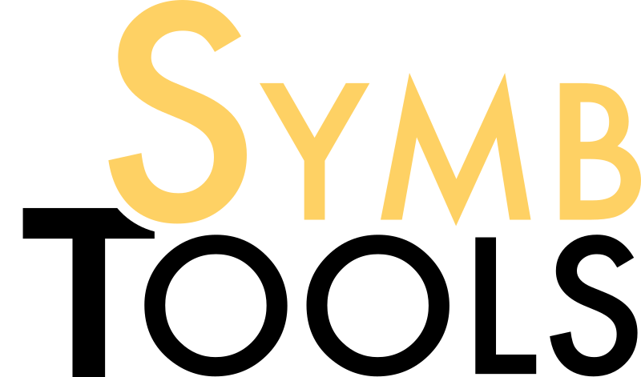

---
# Feel free to add content and custom Front Matter to this file.
# To modify the layout, see https://jekyllrb.com/docs/themes/#overriding-theme-defaults

layout: home
---

# SymbTools – Symbolic Tools in Mathematics and their Application

Die Arbeitsgruppen des Potentialbereichs SymbTools kommen bei Gründung der
Initiative aus der Mathematik und Informatik. Leitthema der Zusammenarbeit ist
die Entwicklung und Anwendung von algorithmischen Methoden und Software der
Computeralgebra, die die mathematischen Kerngebiete Algebra, Geometrie und
Zahlentheorie verschmelzen und als vielseitige Werkzeuge in Mathematik,
Naturwissenschaft und Technik einsetzbar sind. Dabei ist im Bereich „High
Performance Computing“ auch das Fraunhofer-Institut für Techno- und
Wirtschaftsmathematik (ITWM) eingebunden. Das zentrale Großprojekt für die
kommenden Jahre ist die Entwicklung des visionären, interdisziplinären
[Computeralgebrasystems OSCAR](https://www.oscar-system.org), zu dem in wachsender Zahl auch
Wissenschaftlerinnen und Wissenschaftler an anderen Standorten Beiträge
liefern. Es wird erwartet, dass sich OSCAR zu dem weltweit führenden Open
Source System in den genannten mathematischen Kerngebieten und deren
Anwendungsbereichen entwickeln wird, mit unverzichtbaren Tools für tausende
von Forschungsprojekten. Richtungsweisend für die Entwicklung sind
grundlagentheoretische und anwendungsorientierte Probleme der
wissenschaftlichen Fragestellungen der Mitglieder von SymbTools bzw. solche,
die über die starke nationale und internationale Vernetzung an diese
herangetragen werden (aktuell z. B. aus der europäischen Teilchenphysik).
Aufgrund der Ausrichtung, Interdisziplinarität und hohen internationalen
Sichtbarkeit der beteiligten Arbeitsgruppen wird SymbTools einen wesentlichen
Beitrag zur Profilbildung der RPTU im Forschungsfeld „Mathematische
Modellierung, Algorithmen und Simulation" leisten. Ein zentrales Ziel dabei
ist es, anwendungsorientierte Kooperationsprojekte auch an der RPTU
aufzubauen, etwa zusammen mit dem Ingenieurbereich.

# Mitglieder

|**Sprecher**|
|[Prof. Dr. Claus Fieker](https://math.rptu.de/ags/agag/personen/leitung/fieker)|RPTU in Kaiserslautern, FB Mathematik|
|**PIs**|
|[Dr. Janko Böhm](https://agag-jboehm.math.rptu.de/~boehm/index.htm)|RPTU in Kaiserslautern, FB Mathematik|
|[Prof. Dr. Andreas Gathmann](https://math.rptu.de/ags/agag/personen/leitung/gathmann)|RPTU in Kaiserslautern, FB Mathematik|
|[Prof. Dr. Max Horn](https://math.rptu.de/ags/agag/personen/leitung/prof-dr-max-horn)|RPTU in Kaiserslautern, FB Mathematik|
|[Jun.-Prof. Dr. Caroline Lassueur](https://math.rptu.de/ags/agag/personen/leitung/lassueur)|RPTU in Kaiserslautern, FB Mathematik|
|[Prof. Dr. Gunter Malle](https://math.rptu.de/ags/agag/personen/leitung/malle)|RPTU in Kaiserslautern, FB Mathematik|
|[Prof. Dr. Mathias Schulze](https://math.rptu.de/ags/agag/personen/leitung/mschulze)|RPTU in Kaiserslautern, FB Mathematik|
|[Prof. Dr. Ulrich Thiel](https://math.rptu.de/ags/agag/personen/leitung/prof-dr-ulrich-thiel)|RPTU in Kaiserslautern, FB Mathematik|
|**Assoziierte PartnerInnen**|
|[Prof. Dr. Jürgen Roth](https://juergen-roth.de)|RPTU in Landau, FB Natur- und Umweltwissenschaften|
|[Dr. Mirko Rahn](https://www.itwm.fraunhofer.de/de/abteilungen/hpc/mitarbeiter/mirko-rahn.html)|Fraunhofer ITWM, Bereich HPC|
